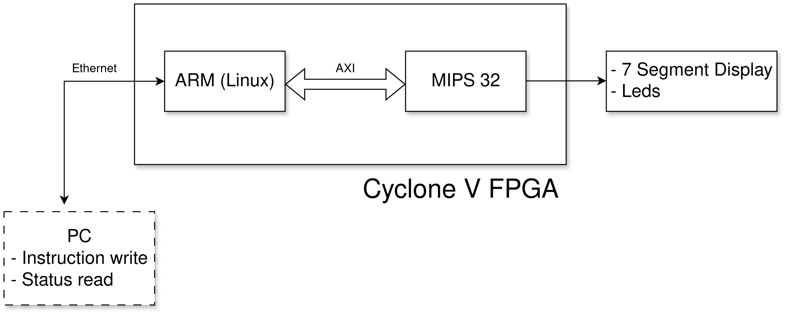
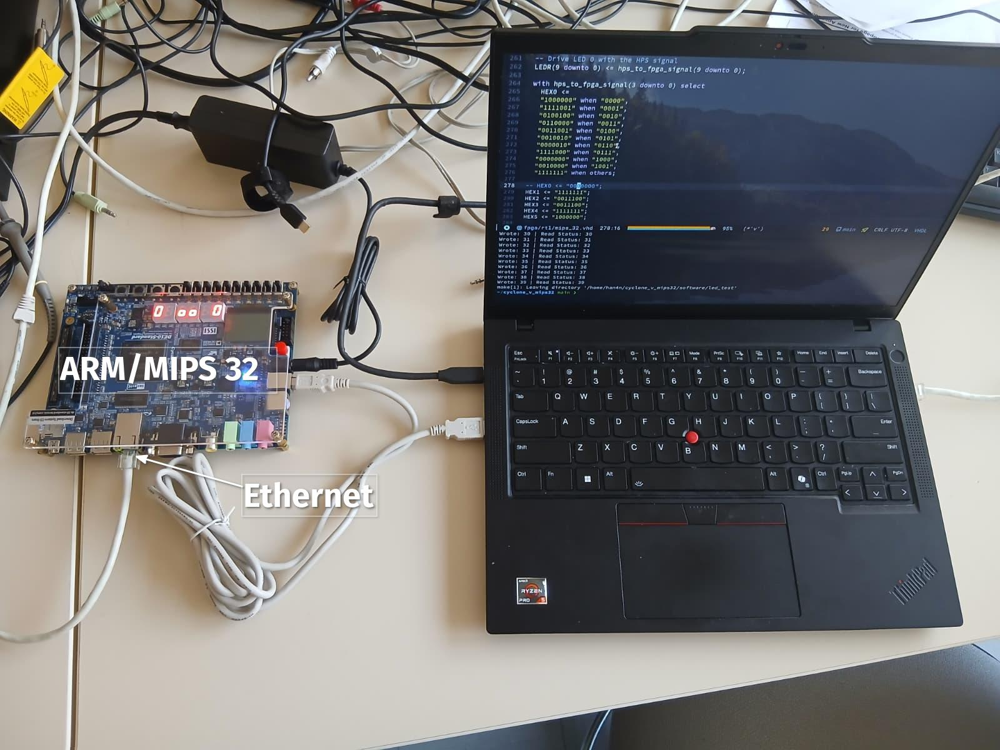
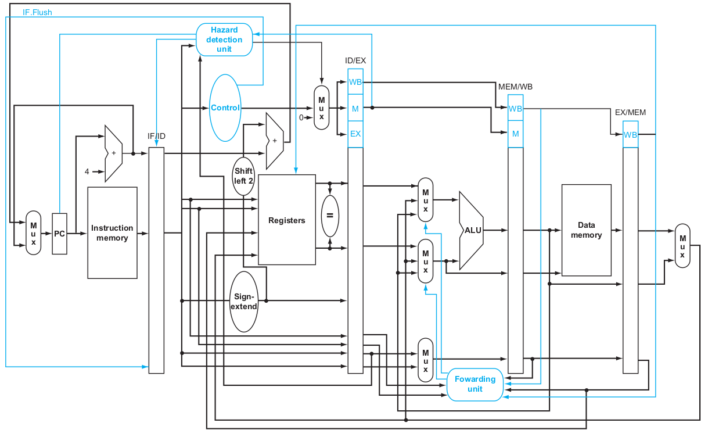

#+TITLE: MIPS 32 Processor
#+subtitle: A Cyclone V Implementation
#+AUTHOR: Hanan Quispe
#+DATE: March 27, 2026
:properties:
#+OPTIONS: toc:nil num:nil html-postamble:nil ^:{} reveal_title_slide:nil
#+REVEAL_ROOT: https://cdn.jsdelivr.net/npm/reveal.js
#+REVEAL_THEME: simple
#+REVEAL_EXTRA_CSS: ./robot-lung-nord.css
#+REVEAL_INIT_OPTIONS: slideNumber:"c/t", transition:"none", transitionSpeed:"fast", controlsTutorial:false, minScale:1.0, maxScale:1.5
#+REVEAL_EXTRA_SCRIPT: for(let e of document.getElementsByClassName("figure-number")){e.parentElement.classList.add("fig-caption");}
#+REVEAL_TITLE_SLIDE: <h1 class="title">%t</h1><em>%s</em>  %a %d
:end:
* Motivation
** Why MIPS32 R2000?
- *Academic Foundation:* Implementing a "Classic 9" instruction subset (R, I, and J-types) to master the standard of RISC HW/SW interfacing.
- *Strategic Engineering:* Utilizing a minimalist ISA to focus 100% on solving complex pipeline hazards (Data, Control, and Structural).
- *Bridge to Modern Cores:* Applying these R2000 fundamentals to better understand high-performance architectures like the RISC-V CVA6.
- *Full-Stack Mastery:* Progressing from high-level architectural modeling to physical RTL synthesis on the Intel Cyclone V FPGA.

* State of the Art
** Comparative Context
- *Historical Baseline:* MIPS R2000 (1985) established the fundamental 5-stage pipeline architecture used in modern RISC cores.
- *Architectural Contrast:* Implementing Branch Delay Slots—a unique MIPS design choice that contrasts with the CVA6 RISC-V architecture.
- *Encoding Efficiency:* A fixed 32-bit instruction length (R, I, and J-types) allows for deterministic, single-cycle hardware decoding.
- *Modern Relevance:* Studying these legacy features provides the critical context needed to optimize modern out-of-order execution systems.

* Experimental Setup
** Block Diagram

** Setup

* MIPS 32 (R2000)
** Architectural Blueprint
- *Datapath:* 5-stage pipeline (IF, ID, EX, MEM, WB).
- *Instructions* : lw, sw, add, sub, AND, OR, slt, beq, and j
- *Components:*
  - *ALU:* 32-bit arithmetic, logic, and shift operations.
  - *Register File:* 32x32-bit (Dual-read, single-write).
  - *Control Unit:* Hardwired logic (VHDL) for opcode decoding.
- *Memory Interface:* Interfacing with Cyclone V M10K blocks for instruction and data storage.
** Block Diagram (Hennessy & Patterson)
#+ATTR_HTML: :width 85%

* Roadmap
** Phase 1: Specification & Component Design (Current)
- ALU and Register File design in VHDL.
- Unit testing with ModelSim testbenches.
** Phase 2: Datapath Integration
- Wiring the IF/ID/EX stages.
- Implementation of the Instruction Decoder logic.
** Phase 3: Memory & FPGA Implementation
- Mapping the memory to Intel Cyclone V resources using Quartus.
- Handling synchronous RAM timing.
** Phase 4: Validation
- Running basic Assembly programs (Fibonacci, Sort) to verify ISA compliance.

* Theoretical Questions
** Critical Design Challenges
- *Hazard Management:* Handling RAW hazards (lw-use) via stalling or forwarding.
- *Structural Integrity:* Why a Harvard Architecture is required for a 1-CPI (Cycles Per Instruction) goal.
- *ISA Implementation:* Managing the Branch Delay Slot in the IF/ID stages.
- *VHDL Concurrency:* How the Control Unit generates signals for the Datapath in a single clock cycle.

* Thank You!
hanan.quispe-condori@polytechnique.edu
