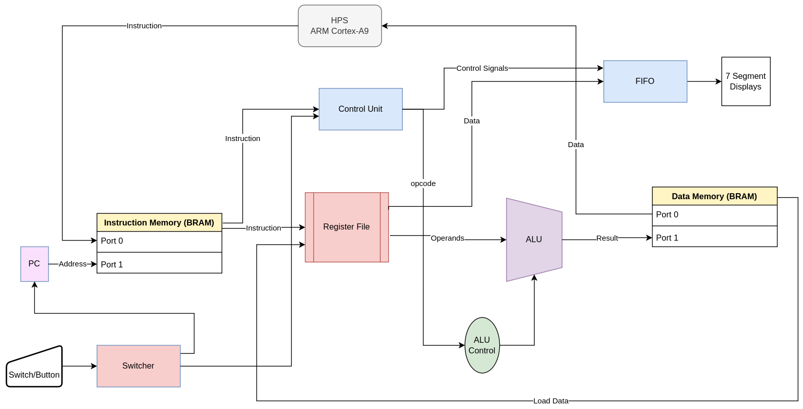
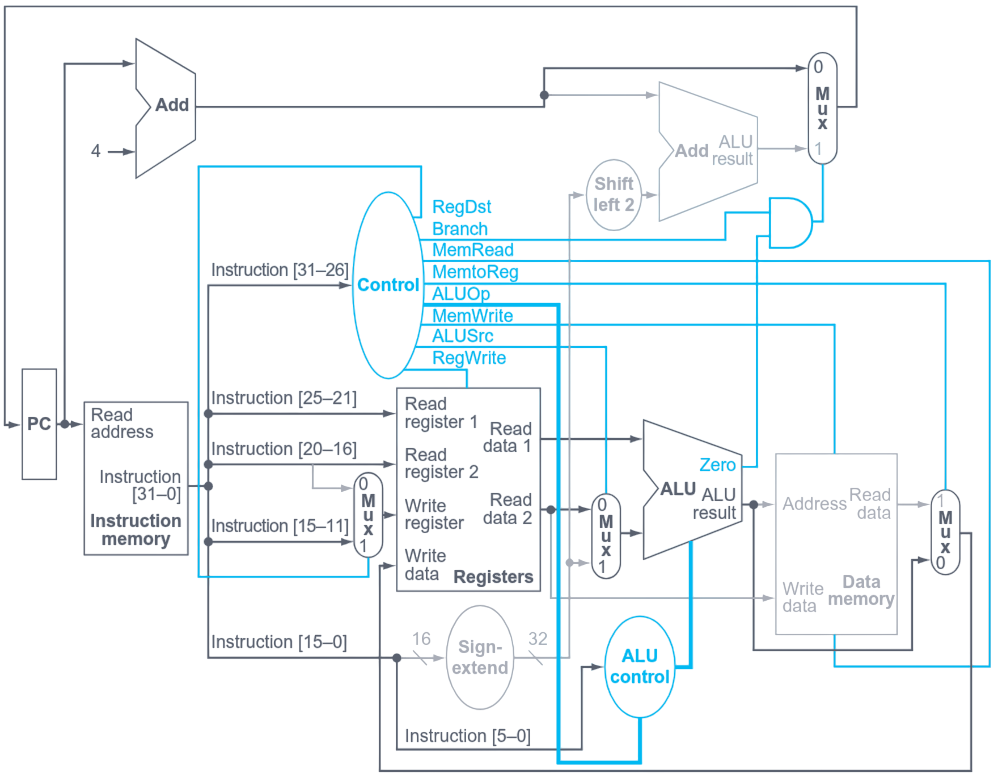
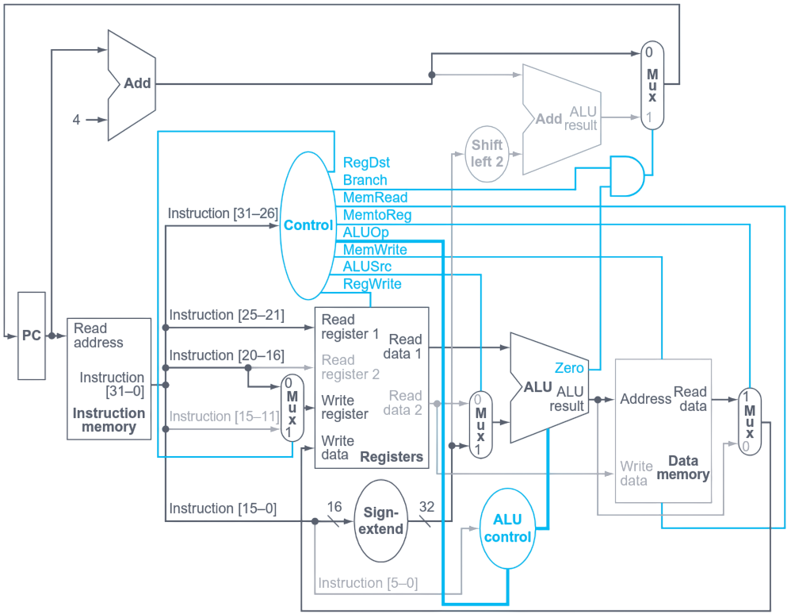
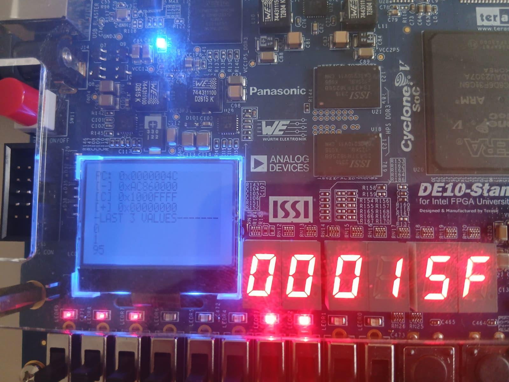
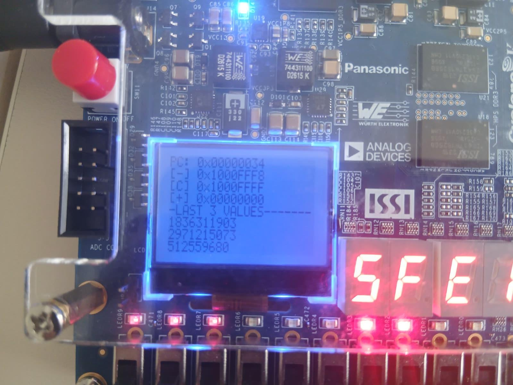

#+TITLE: A MIPS32 Soft Processor on Cyclone V
#+subtitle: FPGA Implementation, HPS Monitoring, and Hardware Demonstration
#+AUTHOR: Hanan Quispe
#+DATE: May 2026
:properties:
#+OPTIONS: toc:nil num:nil html-postamble:nil ^:{} reveal_title_slide:nil
#+REVEAL_ROOT: https://cdn.jsdelivr.net/npm/reveal.js
#+REVEAL_THEME: simple
#+REVEAL_EXTRA_CSS: ./robot-lung-nord.css
#+REVEAL_INIT_OPTIONS: slideNumber:"c/t", transition:"none", transitionSpeed:"fast", controlsTutorial:false, minScale:0.8, maxScale:1.4
#+REVEAL_EXTRA_SCRIPT: for(let e of document.getElementsByClassName("figure-number")){e.parentElement.classList.add("fig-caption");}
#+REVEAL_TITLE_SLIDE: <h1 class="title">%t</h1><em>%s</em>  %a %d
:end:

* Introduction
** Objective
- Implement a /MIPS32-style soft processor/ in VHDL on the /DE10-Standard Cyclone V SoC/.
- Support a useful ISA subset: /add, sub, and, or, slt, addi, lw, sw, beq/.
- Build a /complete demonstrator/, not only a datapath:
  - instruction loading from Linux on the HPS,
  - runtime observation on the LCD and seven-segment displays,
  - end-to-end validation with assembly programs.
- Main result: a working /3-stage staged processor/ adapted to FPGA synchronous memories.

** Outline
1. Context and design choices
2. Implemented architecture
3. Development and integration
4. Validation results
5. Theoretical discussion
6. Demo tutorial
7. Conclusion and future work

* Context
** System-Level Summary
- FPGA side: MIPS core, instruction memory, data memory, observability logic.
- HPS side: program loading, state readback, LCD monitor.
- Result: a complete HW/SW co-design around the processor.
** System-Level View
#+ATTR_HTML: :width 110%
[[../../report/images/block_diagram.png]]

* Architecture
** Reference Datapath
#+ATTR_HTML: :width 78%
[[../../report/images/Single.png]]

** Implemented Datapath
#+ATTR_HTML: :width 150%

** Target vs Implemented Organization
- The reference starting point is the /classical single-cycle MIPS datapath/.
- The final implementation is /not a five-stage overlapped pipeline/.
- Because the Cyclone V BRAMs are synchronous, the design was reorganized into /three execution stages/:
  1. /Fetch/
  2. /Execute/
  3. /Write-back/
- Therefore, one instruction completes in /3 clock cycles/ in the delivered system.

** Implemented Processor
- /32-bit datapath/ with a /32 x 32-bit register file/.
- /Harvard organization/: separate instruction and data memories.
- Main blocks:
  - program counter,
  - register file,
  - main control and ALU control,
  - ALU,
  - sign extension and address-generation logic,
  - BRAM-backed instruction and data memories.
** Implemented Instruction Set Architecture
*** R type instructions
- add rd, rs, rt (Add: $rd = rs + rt$)
- sub rd, rs, rt (Subtract: $rd = rs - rt$)
- and rd, rs, rt (Bitwise AND: $rd = rs \ \& \ rt$)
- or  rd, rs, rt (Bitwise OR: $rd = rs \ | \ rt$)
- slt rd, rs, rt (Set on Less Than: $rd = 1$ if $rs < rt$, else $0$)
*** I type instructions
- lw rt, offset(rs) (Load Word: Memory[$rs$ + offset] $\rightarrow rt$)
- sw rt, offset(rs) (Store Word: $rt \rightarrow$ Memory[$rs$ + offset])
- addi rt, rs, immediate (Add Immediate: $rt = rs + \text{immediate}$)
- beq rs, rt, label (Branch if Equal: If $rs == rt$, PC jumps to label)
** Assembly to Machine Code Example
- /R-type: add $4, $0, $0/
  #+begin_example
  opcode | rs    | rt    | rd    | shamt | funct
  000000 | 00000 | 00000 | 00100 | 00000 | 100000
  → 0x00002020
  #+end_example
- /I-type: beq $0, $0, -1/
  #+begin_example
  opcode | rs    | rt    | immediate
  000100 | 00000 | 00000 | 1111111111111111
  → 0x1000FFFF
  #+end_example
** Instruction Encoding Reference
*** /R-type instructions/ (opcode = 000000):
*funct*
  |-----+--------+--------|
  | add | 100000 | 0x20   |
  | sub | 100010 | 0x22   |
  | and | 100100 | 0x24   |
  | or  | 100101 | 0x25   |
  | slt | 101010 | 0x2A   |
  |-----+--------+--------|
*** /I-type instructions/:
*opcode*
  |------+--------+------|
  | lw   | 100011 | 0x23 |
  | sw   | 101011 | 0x2B |
  | addi | 001000 | 0x08 |
  | beq  | 000100 | 0x04 |
  |------+--------+------|
- /shamt/ field: always 00000 for non-shift instructions

** R-type Instruction Datapath
#+ATTR_HTML: :width 78%

** I-type Instruction Datapath
#+ATTR_HTML: :width 78%

* Platform Integration
** Board-Level Demonstrator
- /Manual mode/: step through fetch, execute, and write-back.
- /Automatic mode/: run continuously.
- The /switcher/ block controls when state updates are allowed.
- A small FIFO keeps the /three latest stored values/ (sw instruction) for visual observation.
** Demonstrator on the Board
#+ATTR_HTML: :width 72%
[[../../report/images/visual.jpeg]]

* Validation
** Validation Strategy
- /Unit-level validation/ in simulation:
  - ALU,
  - ALU control,
  - register file,
  - program counter,
  - main control.
- /Integration validation/:
  - HPS-to-FPGA AXI bridge read/write tests,
  - instruction-memory programming from Linux,
  - data-memory readback.
- /System-level validation/:
  - Fibonacci program,
  - mixed ISA validation program,
  - LCD and seven-segment observation on the board.

** Validation Flow
- Assemble the program with the custom Python assembler.
- Load the generated machine code into /instruction memory/ from the HPS.
- Run the processor on the FPGA in /manual/ or /automatic/ mode.
- Observe:
  - /program flow/ on the LCD,
  - /recent memory stores/ on the seven-segment displays,
  - /memory contents/ through HPS-side utilities.
- This validates the entire chain from assembly source to hardware execution.

** Fibonacci Demonstration
- The main demonstrator stores successive Fibonacci values into data memory.
- Why this program is useful:
  - repeated arithmetic operations,
  - loop control with /beq/,
  - repeated /sw/ operations,
  - easy numerical verification through memory readback.
- Expected sequence begins with:
  - /0, 1, 1, 2, 3, 5, 8, ..., 89, 144, 233, .../

** Fibonacci Board View
#+ATTR_HTML: :width 72%
[[../../report/images/normal_fibo.jpeg]]

** ISA Validation Program
- This second program checks that the processor is not limited to one benchmark.
- It combines:
  - arithmetic operations,
  - comparison with /slt/,
  - memory stores and a load,
  - a final modification of the loaded value.
- It is useful because each store can be inspected in memory and on the display path.

** ISA Board View
#+ATTR_HTML: :width 78%

** 32-Bit Limitation
- The datapath and register file are /32 bits/ wide.
- Fibonacci eventually exceeds $2^{32}$.
- The stored result then /wraps around modulo $2^{32}$/.
- This is not a bug in the demonstrator: it is the expected consequence of a 32-bit implementation.

** Overflow Example
#+ATTR_HTML: :width 78%

** Resource Utilization
- Post-fit utilization on /Cyclone V 5CSXFC6D6F31C6/:
  - /2,000 ALMs/ out of /41,910/ available, about /5%/,
  - /3,230 registers/,
  - /65,536 block memory bits/,
  - /8 RAM blocks/,
  - /0 DSP blocks/.
- Conclusion: the processor and its observability infrastructure fit comfortably on the target FPGA.

* Theoretical Discussion
** From Pipeline Theory to Staged Reality
- /Original goal/: 5-stage pipeline, 1-CPI throughput
- /Reality/: Synchronous BRAMs → 3-stage staged processor (3 cycles/instruction)
- /Why discuss pipeline theory?/ Foundation for future optimization

** Data Hazards: RAW After /lw/
#+begin_src asm
lw   $t0, 0($t1)
add  $t2, $t0, $t3  # $t0 not ready!
#+end_src
- /Pipeline solutions/: forwarding or stalling
- /Staged processor/: serialized execution avoids the hazard

** Control Hazards: Branch Delay Slots
- /MIPS feature/: instruction after branch always executes
- /Pipeline benefit/: simplifies control, no IF flush needed
- /Current implementation/: branches complete before next fetch
- /Result/: delay slot not exposed to programmer

** Single-Cycle Control Generation
- Control unit = pure combinational logic
- Opcode → Boolean equations → control signals
- Signals settle within clock period
- Sequential elements sample on clock edge

** Theory vs. Implementation Summary
|------------------+-------------------------+----------------------|
| Concern          | Pipeline                | Staged               |
|------------------+-------------------------+----------------------|
| Data (RAW)       | Forwarding/stalling     | Serialization        |
| Control          | Delay slot/prediction   | No delay slot        |
| Control timing   | Combinational critical  | Same                 |
|------------------+-------------------------+----------------------|

* Demo Tutorial
** Goal of the Demo Section
- We will see two concrete examples:
  - /Fibonacci/ for the main demonstration,
  - /ISA test/ for instruction coverage.
** Step 1: Build and Configure the FPGA
- First, synthesize the design and generate the bitstream:
  #+begin_src bash
  make fpga-build
  #+end_src
- Then program the FPGA fabric through JTAG:
  #+begin_src bash
  make fpga-flash
  #+end_src
- After this step, the hardware platform is ready, but instruction memory is still empty.

** Step 2: Assemble a Program
- The custom Python assembler converts MIPS assembly into /32-bit hexadecimal words/.
- For the Fibonacci demo:
  #+begin_src bash
  python3 scripts/assembler.py scripts/fibo.asm -o scripts/program.hex
  #+end_src
- For the ISA validation demo:
  #+begin_src bash
  python3 scripts/assembler.py scripts/isa.asm -o scripts/program.hex
  #+end_src
- The generated file /scripts/program.hex/ is the image that will be loaded into instruction memory.

** Step 3: Copy the Program and Flasher to the HPS
- The /software/flasher/ utility is the program that writes /program.hex/ into FPGA instruction memory from Linux.
- The actual deployment commands are:
  #+begin_src bash
  scp software/flasher/flasher.c cyclone:~/scripts/
  scp scripts/program.hex cyclone:~/scripts/
  ssh cyclone "gcc ~/scripts/flasher.c -o ~/scripts/flasher -std=gnu99"
  #+end_src
- The equivalent Make target is:
  #+begin_src bash
  make flasher_deploy
  #+end_src

** Step 4: Flash the Instruction Memory from the HPS
- Once the flasher and /program.hex/ are on the board, the HPS loads the instruction BRAM:
  #+begin_src bash
  ssh cyclone "~/scripts/flasher ~/scripts/program.hex"
  #+end_src
- The equivalent Make target is:
  #+begin_src bash
  make flasher_run
  #+end_src
- This is the key step of the tutorial: the FPGA bitstream is already programmed, and now the /instruction memory contents/ are programmed from Linux.

** Step 5: Observe Execution
- Several observation methods are available after flashing:
  #+begin_src bash
  make fibo-read
  make lcd_run
  #+end_src
- /make fibo-read/ reads back data memory contents from the HPS side.
- /make lcd_run/ starts the LCD monitor that shows the PC and nearby instructions.
- On the board itself, the LEDs and seven-segment displays give immediate visual feedback.

** Fibonacci Example: Program Logic
- /scripts/fibo.asm/ initializes:
  - the current term,
  - the next term,
  - the data-memory pointer,
  - the loop counter.
- The loop then performs four actions repeatedly:
  1. test the stopping condition with /beq/,
  2. store the current Fibonacci value with /sw/,
  3. compute the next pair of terms,
  4. increment the pointer and counter.
- The instruction /beq $0, $0, -8/ acts as an unconditional backward branch to the loop.

** Fibonacci Example: What to Show Live
- Start from:
  #+begin_src bash
  python3 scripts/assembler.py scripts/fibo.asm -o scripts/program.hex
  make flasher_deploy
  make flasher_run
  #+end_src
- Then show one of the observation paths:
  #+begin_src bash
  make fibo-read
  #+end_src
  or
  #+begin_src bash
  make lcd_run
  #+end_src
- Expected data-memory sequence begins with /0, 1, 1, 2, 3, 5, 8/.

** ISA Example: Program Logic
- /scripts/isa.asm/ is a compact functional test of the implemented ISA subset.
- It demonstrates:
  - /addi/ to create constants,
  - /add/ and /sub/ for arithmetic,
  - /slt/ for comparison,
  - /sw/ to store results in data memory,
  - /lw/ to read a stored word back,
  - a final /addi/ and /sw/ to confirm load-use correctness in the staged design.
- The final /beq $0, $0, -1/ traps execution at the end of the test.

** ISA Example: How to Run It
- Generate the machine code:
  #+begin_src bash
  python3 scripts/assembler.py scripts/isa.asm -o scripts/program.hex
  #+end_src
- Deploy and flash it:
  #+begin_src bash
  make flasher_deploy
  make flasher_run
  #+end_src
- Then inspect the result with the same tools:
  #+begin_src bash
  make fibo-read
  make lcd_run
  #+end_src
- This example is useful during the defense because each stored result corresponds to a specific supported instruction.

** Demo Tutorial Summary
- /Host PC/:
  - build FPGA,
  - assemble /fibo.asm/ or /isa.asm/.
- /Transfer to HPS/:
  - use /scp/ for /flasher.c/ and /program.hex/.
- /Execution on HPS/:
  - compile the flasher with /gcc/,
  - run it to program instruction memory.
- /Observation/:
  - LCD monitor,
  - HPS memory readback,
  - board LEDs and seven-segment displays.

* Conclusion
** Conclusion
- The project produced a /working MIPS32-style processor demonstrator/ on Cyclone V.
- The final contribution is both:
  - a functional processor core,
  - a complete experimentation environment with assembler, flasher, HPS tools, LCD monitor, and board-level observability.
- The implementation is /functionally operational/ and /hardware-demonstrated/.
- The key architectural adaptation was moving from the textbook single-cycle view to a /practical 3-stage execution model/ compatible with FPGA memories.

** Future Work
- Move from staged execution to a /true pipelined architecture/.
- Add support for floating point operations (fpu).
- Extend the ISA, especially jumps and additional immediate operations.
- Strengthen the HPS monitor with richer debug information.

** Thank You
- Questions?
- Contact: hanan.quispe-condori@polytechnique.edu
