#+title: A MIPS32 Processor Implementation
#+latex_class: koma-article
#+options: toc:t date:t author:t
#+latex: \newpage
* Project overview

This report presents the implementation of a MIPS32-style soft processor on Terasic's DE10-Standard Development Kit. The design supports a subset of the MIPS instruction set architecture composed of /add, sub, and, or, slt, lw, sw, addi,/ and /beq/, and its initial organization is derived from the single-cycle processor described by [[citet:&john_l_hennessy_computer_2013]].

The hardware platform is based on an Intel Cyclone V SoC, device /5CSXFC6D6F31C6/, clocked from the board's /50 MHz/ oscillator. In addition to the FPGA fabric, the board includes an ARM-based Hard Processor System (HPS) running embedded Linux. In this project, the HPS is used as a host-side service processor: it loads programs into the instruction memory, reads back processor state through the lightweight HPS-to-FPGA AXI bridge, and drives the on-board $128 \times 64$ LCD monitor used for runtime observation.

The implemented processor uses a /32-bit/ datapath, a $32 \times 32$ bit register file, and separate instruction and data memories mapped in the FPGA fabric. This Harvard-style organization simplifies instruction fetch and data access and also makes the processor easier to observe from the HPS side. The final demonstrator allows a user to write an assembly program, assemble it into hexadecimal machine code, program the instruction memory from Linux, execute the program on the FPGA core, and inspect the results through the LCD, the seven-segment displays, and dedicated status registers exported to the HPS.

#+attr_org: :width 600
#+caption: General Block Diagram
#+name: fig:general_schema
#+attr_latex: :width 17.0cm :options angle=0
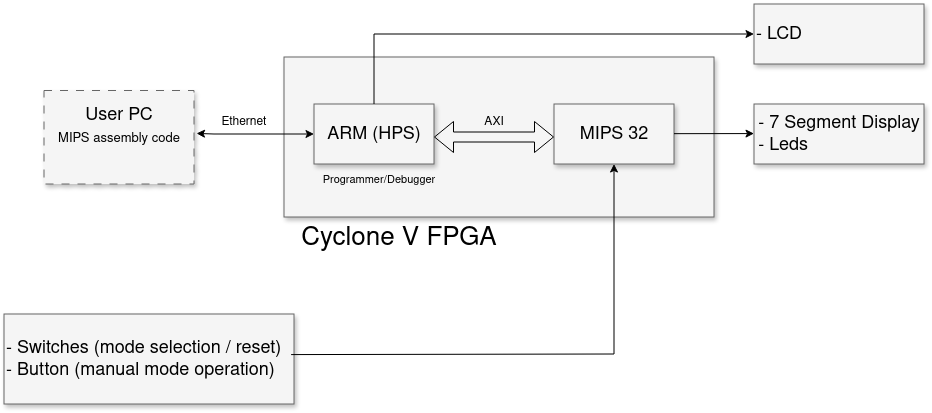

* Project specification

This section defines the technical specifications of the implemented processor and of the platform on which it runs. Although the design is conceptually inspired by the single-cycle MIPS processor shown in figure [[fig:single_cycle]], the final implementation is constrained by the synchronous memories available in the Cyclone V FPGA fabric and by the integration with the HPS.

** Processor architecture

The implemented core is a /32-bit/ processor with a datapath organized around the usual MIPS building blocks: a program counter (PC), instruction memory, register file, ALU, data memory, main control unit, ALU control unit, sign extender, adders, shifters, and multiplexers. The register file contains $32$ registers of $32$ bits, with two read ports and one write port.

The memory system follows a Harvard organization. Instruction memory and data memory are implemented as separate on-chip memories in the FPGA fabric, each with a capacity of /1024 words of 32 bits/, corresponding to /4 KB/ per memory block. This separation simplifies the organization of the datapath and makes HPS-side debugging easier, since instructions and data can be accessed independently through their dedicated address ranges.

#+attr_org: :width 600
#+caption: Single Cycle Processor [[cite:&john_l_hennessy_computer_2013]]
#+name: fig:single_cycle
#+attr_latex: :width 17.0cm :options angle=0
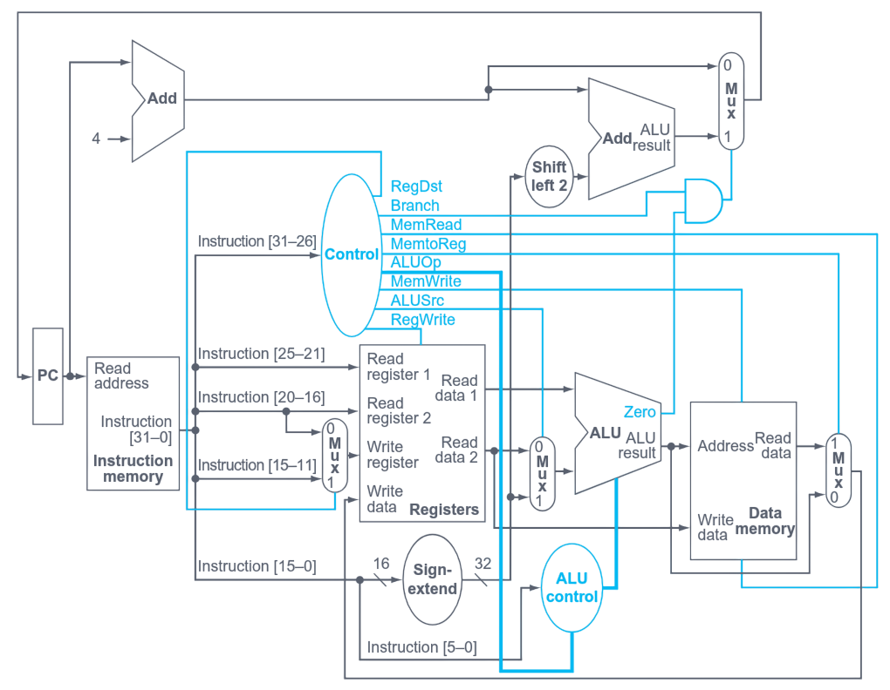

** Execution model

The reference single-cycle architecture assumes that instruction fetch, decoding, computation, and memory access can all be completed within one clock period. In the implemented system, this assumption does not hold because the FPGA block memories used for instruction and data storage are synchronous. Consequently, the processor was reorganized into a /three-stage execution model/ in which each instruction is completed in three clock cycles.

The three stages are:

1. *Fetch*.
   During this cycle, the program counter provides the address of the next instruction. The instruction memory is accessed, and the fetched instruction becomes available for the next stage.
2. *Execute*.
   During this cycle, the instruction is decoded, the control signals are generated, the register operands are read, and the ALU computes the required result or effective address.
3. *Write-back*.
   During this cycle, the final architectural update is performed. For arithmetic and logical instructions, the result is written into the register file. For /lw/ and /sw/, the data memory is accessed and the corresponding register or memory state is updated.

This organization implies that the implemented processor is not a true single-cycle core and not yet a full five-stage pipelined processor either. Instead, it is a staged processor in which one instruction completes every three clock cycles. The execution can be driven either in free-running mode or in manual step-by-step mode, which is particularly useful for debugging and demonstration on the board.

** Implemented ISA

The processor implements a subset of the MIPS ISA composed of R-type and I-type instructions. The supported operations are /add, sub, and, or, slt, lw, sw, addi,/ and /beq/. Before describing each hardware block, it is useful to review these instruction formats, since they determine how each bit field is mapped onto the datapath and the control logic.

*** R-type instructions
These instructions perform register-to-register operations, meaning that both the inputs and the destination are registers.
- add rd, rs, rt (Add: $rd = rs + rt$)
- sub rd, rs, rt (Subtract: $rd = rs - rt$)
- and rd, rs, rt (Bitwise AND: $rd = rs \ \& \ rt$)
- or  rd, rs, rt (Bitwise OR: $rd = rs \ | \ rt$)
- slt rd, rs, rt (Set on Less Than: $rd = 1$ if $rs < rt$, else $0$)

An R-type instruction is 32 bits long and is divided into six distinct fields:

#+caption: R-type instruction fields
#+label: tab:R_type
|--------+------+-------------+---------------------------------------------------------|
| *Field*  | *Bits* | *Range*       | *Description*                                             |
|--------+------+-------------+---------------------------------------------------------|
| opcode |    6 | [26 $\rightarrow$ 31] | Operation code (0 for all R-type instructions)          |
| rs     |    5 | [21 $\rightarrow$ 25] | First source register                                   |
| rt     |    5 | [16 $\rightarrow$ 20] | Second source register                                  |
| rd     |    5 | [11 $\rightarrow$ 15] | Destination register (receives the result)              |
| shamt  |    5 | [6 $\rightarrow$ 10]  | Shift amount (0 for non-shift instructions)             |
| funct  |    6 | [0 $\rightarrow$ 5]   | Function code (specifies the specific R-type operation) |
|--------+------+-------------+---------------------------------------------------------|

*** I-type instructions

These instructions are used for operations involving immediate values, memory access, or branching.
- lw rt, offset(rs) (Load Word: Memory[$rs$ + offset] $\rightarrow rt$)
- sw rt, offset(rs) (Store Word: $rt \rightarrow$ Memory[$rs$ + offset])
- addi rt, rs, immediate (Add Immediate: $rt = rs + \text{immediate}$)
- beq rs, rt, label (Branch if Equal: If $rs == rt$, PC jumps to label)

An I-type instruction is 32 bits long and divided into four distinct fields:

#+caption: I-type instruction fields
#+label: tab:I_type
|-----------+------+-------------+----------------------------------------------------|
| Field     | Bits | Range       | Description                                        |
|-----------+------+-------------+----------------------------------------------------|
| opcode    |    6 | [26 $\rightarrow$ 31] | Operation code (identifies the I-type instruction) |
| rs        |    5 | [21 $\rightarrow$ 25] | First source register                              |
| rt        |    5 | [16 $\rightarrow$ 20] | Second register (target or source depending on op) |
| immediate |   16 | [0 $\rightarrow$ 15]  | 16-bit constant, offset, or branch target          |
|-----------+------+-------------+----------------------------------------------------|

In I-type instructions, the 16-bit immediate field replaces the /rd/, /shamt/, and /funct/ fields used in the R-type format.

** Host interface and observability

The processor is coupled to the HPS through the lightweight HPS-to-FPGA AXI bridge. In the implemented system, the bridge base address is \texttt{0xFF200000} and the software utilities use a mapped span of \texttt{0x00200000}. This interface allows the HPS to access the processor memories and exported status registers directly from Linux user space through /open("/dev/mem")/ and /mmap()/ [[cite:&terasic_technologies_de10-standard_2018]].

In addition to the software-visible registers, the project uses the board peripherals as direct debug interfaces. The six seven-segment displays show the three most recent values written to data memory, the LEDs expose internal control and execution states, and the LCD monitor shows the current program counter and nearby instructions in real time. Manual stepping is enabled with /SW(9)/ and triggered with /KEY(0)/.

The memory-mapped addresses used by the current demonstrator are summarized in table [[tab:memory_map]].

#+caption: Memory map exported to the HPS
#+label: tab:memory_map
|---------+------------------------|
| Address | Function               |
|---------+------------------------|
|  0x0000 | Data memory window     |
|  0x1000 | Instruction memory     |
|  0x2000 | FIFO valid bits        |
|  0x2010 | FIFO update counter    |
|  0x2020 | FIFO slot 2            |
|  0x2030 | FIFO slot 1            |
|  0x2040 | FIFO slot 0            |
|  0x2050 | Program counter/status |
|---------+------------------------|

* Development tools and techniques

The project followed a bottom-up roadmap consistent with the milestones defined during the project follow-up meeting. This was a solo project completed over a /10-week/ period from /March 20/ to /May 25, 2026/. The work started with HPS-FPGA communication through the AXI bridge, continued with the design and simulation of the elementary processor blocks, then moved to datapath and memory integration, and finally reached board-level validation with assembly programs, LCD monitoring, and HPS-side debug tools. From a project-management perspective, this progression can be summarized in four phases: specification and component design, datapath integration, memory and board implementation, and final validation.

This methodology also structured the technical workflow. First, each functional block was validated independently in simulation. Next, the validated blocks were assembled into a complete datapath and connected to the Platform Designer memories and bridge interfaces. Finally, the integrated system was exercised on the board with software tools for program generation, instruction-memory loading, and runtime observation.

** Project timeline

Table [[tab:timeline]] summarizes the major milestones and development phases throughout the project duration, as recorded in the version control history. The project spanned /10 weeks/ and progressed through four distinct phases.

#+caption: Project timeline and major milestones
#+label: tab:timeline
|-----------+---------------------------------+---------------------------------------|
| Date      | Phase                           | Key Accomplishments                   |
|-----------+---------------------------------+---------------------------------------|
| *March 20*  | *Phase 1: Infrastructure Setup*   | • HPS-FPGA AXI bridge validated       |
| (Week 1)  |                                 | • Memory-mapped read/write confirmed  |
|           |                                 | • Build automation (Makefiles) added  |
|-----------+---------------------------------+---------------------------------------|
| *March 27*  | *Phase 1: Component Design*       | • ALU designed and simulated          |
| (Week 2)  |                                 | • ALU control unit implemented        |
|           |                                 | • Project presentation prepared       |
|-----------+---------------------------------+---------------------------------------|
| *April 3*   | *Phase 1: Core Components*        | • Register file (32×32-bit) completed |
| (Week 3)  |                                 | • Program counter with enable/reset   |
|           |                                 | • Unit testbenches validated          |
|-----------+---------------------------------+---------------------------------------|
| *April 10*  | *Phase 2: Memory Integration*     | • BRAM blocks instantiated            |
| (Week 4)  |                                 | • PC connected to instruction memory  |
|           |                                 | • Main control decoder added          |
|-----------+---------------------------------+---------------------------------------|
| *April 17*  | *Phase 2: Datapath Assembly*      | • Complete datapath integrated        |
| (Week 5)  |                                 | • All processor blocks wired          |
|           |                                 | • Top-level structural design done    |
|-----------+---------------------------------+---------------------------------------|
| *April 24*  | *Phase 3: First Working System*   | • Processor executes on FPGA          |
| (Week 6)  |                                 | • Initial instruction tests passed    |
|           |                                 | • Hardware functionality confirmed    |
|-----------+---------------------------------+---------------------------------------|
| *May 2*     | *Phase 3: Execution Control*      | • Manual step-by-step mode added      |
| (Week 7)  |                                 | • Free-run continuous mode added      |
|           |                                 | • Switcher block with stage control   |
|-----------+---------------------------------+---------------------------------------|
| *May 4*     | *Phase 4: Demonstration Programs* | • Fibonacci sequence validated        |
| (Week 8)  |                                 | • LCD monitor fully integrated        |
|           |                                 | • HPS observation tools operational   |
|-----------+---------------------------------+---------------------------------------|
| *May 15*    | *Phase 4: Final Validation*       | • ISA test program developed          |
| (Week 9)  |                                 | • Additional assembly tests added     |
|           |                                 | • Pin assignments optimized           |
|-----------+---------------------------------+---------------------------------------|

# The timeline shows a systematic bottom-up progression. *Weeks 1-3* established the HPS-FPGA infrastructure and implemented core processor components with individual validation. *Weeks 4-5* focused on memory integration and complete datapath assembly. *Week 6* achieved the first working processor on hardware. *Weeks 7-9* added execution control features, developed demonstration programs, performed final validation, and completed the project.

** Development toolchain and simulation infrastructure

The HDL implementation was written in VHDL and synthesized with Intel Quartus Prime Lite /20.1.0 Build 711/. Platform Designer was used to generate the HPS subsystem, the lightweight AXI bridge interconnect, and the on-chip instruction and data memories. The automated hardware build is driven by the top-level /Makefile/, which calls \texttt{quartus\_sh -t build.tcl}, while FPGA configuration is performed through JTAG with \texttt{quartus\_pgm} using device index /2/.

Functional simulation was carried out with ModelSim, and the generated waveforms were inspected with GTKWave. The testbench flow covers the ALU, ALU control, register file, program counter, and main control blocks. The scripted simulation durations are /60 ns/ for the ALU, /80 ns/ for the ALU control, /220 ns/ for the register file, /50 ns/ for the program counter, and /80 ns/ for the main control unit.

On the software side, the project relies on a custom Python /two-pass assembler/ that translates user-written MIPS assembly into hexadecimal machine code. HPS-side support programs are written in C and use \texttt{gcc -std=gnu99} when built directly on the board. The LCD monitor is cross-compiled on the host with \texttt{arm-linux-gnueabihf-gcc} and links against the Intel SoC EDS HPS hardware libraries. Deployment to the board is performed through /scp/ and /ssh/, with the documented host alias /cyclone/ pointing to the target IP address /10.42.0.50/.

Beyond the software toolchain, the implementation techniques used for the processor blocks are also important. The design mixes synchronous sequential blocks for architectural state, such as the program counter and register file, with combinational blocks for decoding, ALU control, multiplexing, sign extension, and address calculation. This organization follows the classical MIPS datapath while remaining compatible with the synchronous BRAM resources of the Cyclone V FPGA.

** Program counter implementation

The program counter is implemented in /fpga/rtl/core/pc.vhd/ as a simple /32-bit/ synchronous register with reset and enable. Its role is to hold the address of the current instruction and update that address only when the execution controller authorizes it. Figure [[fig:pc_block]] shows the synthesized structure of this block.

#+attr_org: :width 600
#+caption: Program counter implementation
#+name: fig:pc_block
#+attr_latex: :width 10cm
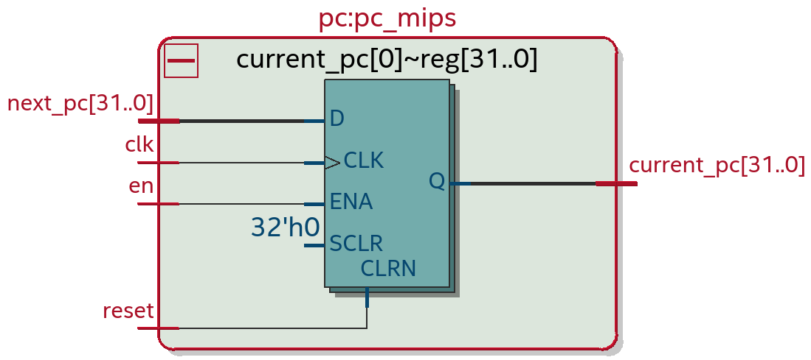

The behavior is intentionally minimal. When /reset = '1'/, the output is forced to \texttt{0x00000000}. Otherwise, on each rising clock edge, the register loads \texttt{next\_pc} only if /en = '1'/. This enable signal is essential in the final design because the processor does not retire one full instruction per cycle. Instead, the /switcher/ block only allows the program counter to advance at the end of the write-back stage. The program counter therefore acts as the main architectural state element that synchronizes instruction sequencing with the three-stage execution model.

** Register file implementation

The register file is implemented in /fpga/rtl/core/regist.vhd/ as an array of /32/ registers of /32 bits/. It provides two independent combinational read ports and one synchronous write port. Figure [[fig:register_block]] shows the synthesized structure of this block.

#+attr_org: :width 650
#+caption: Register file implementation
#+name: fig:register_block
#+attr_latex: :width 11cm
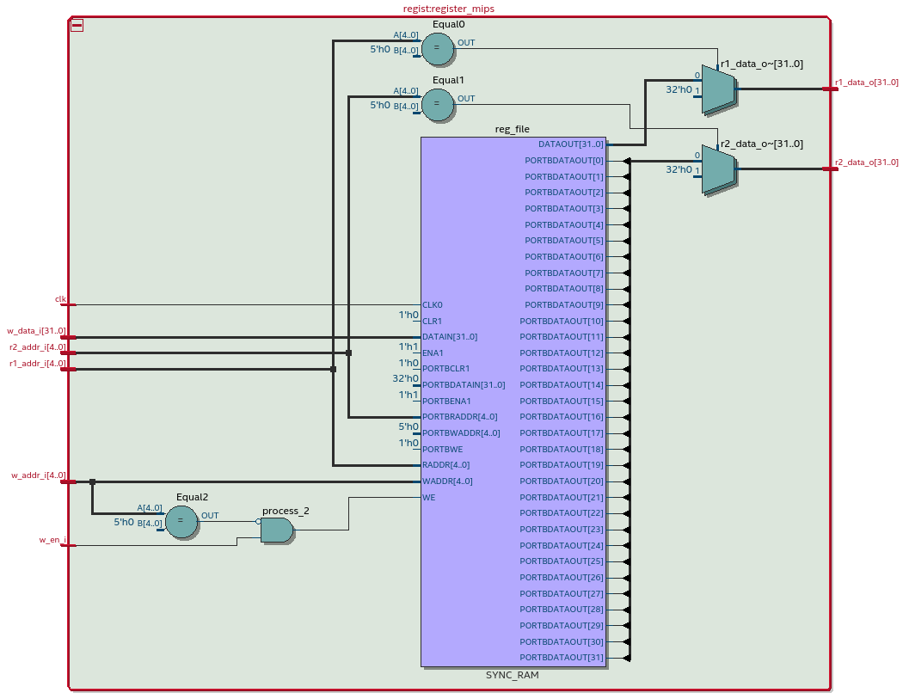

The implementation enforces the MIPS convention that register /$0/ is hardwired to zero. This is done in two places. First, both read processes explicitly return \texttt{0x00000000} whenever the requested read address is /00000/. Second, the write process blocks any write attempt whose destination address is /00000/. As a result, register /$0/ cannot be modified even if the control path erroneously asserts a write. Reads from the register bank are asynchronous with respect to the clock, which is consistent with the datapath requirement of obtaining operands during the execute phase, while writes occur only on the rising clock edge when /w_en_i/ is asserted.

** Main control implementation

The main control unit is implemented in \texttt{/fpga/rtl/core/main\_ctrl.vhd/} as a purely combinational decoder driven by the /6-bit/ opcode field. Instead of assigning each output independently in separate branches, the implementation first generates a compact /9-bit/ intermediate vector and then maps that vector to the individual control signals. The resulting truth table is summarized in figure [[fig:main_control_table]].

#+attr_org: :width 650
#+caption: Main control truth table for the supported instructions
#+name: fig:main_control_table
#+attr_latex: :width 13cm
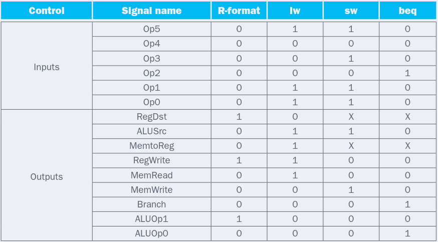

The decoder currently distinguishes five opcode classes: R-type, /lw/, /sw/, /beq/, and /addi/. The specific opcode assignments are summarized in table [[tab:opcodes]].

#+caption: Opcode assignments for the implemented instruction subset
#+label: tab:opcodes
|-------------+--------------+-------------------|
| Instruction | Opcode (bin) | Opcode (hex)      |
|-------------+--------------+-------------------|
| R-type      | 000000       | 0x00              |
| lw          | 100011       | 0x23              |
| sw          | 101011       | 0x2B              |
| beq         | 000100       | 0x04              |
| addi        | 001000       | 0x08              |
|-------------+--------------+-------------------|

The /addi/ instruction represents an extension beyond the reference single-cycle processor described in the Hennessy and Patterson textbook, which originally included only /add, sub, and, or, slt, lw, sw,/ and /beq/. The addition of /addi/ with opcode /001000/ (0x08) improves the processor's practical utility by allowing immediate-value arithmetic without requiring a separate load operation, which is particularly useful for loop counters, address calculations, and constant initialization in programs like the Fibonacci demonstration.

For each opcode, the control decoder generates a /9-bit/ intermediate vector that is then mapped to individual control signals. For example, the R-type opcode /000000/ produces the vector /100100010/, which activates /RegDst/, /RegWrite/, and sets /ALUOp/ to /10/ for R-type decoding. The /lw/ instruction (opcode /100011/) produces /011110000/, which activates /ALUSrc/, /MemtoReg/, /RegWrite/, and /MemRead/. The /addi/ instruction (opcode /001000/) generates /010100000/, which activates /ALUSrc/ and /RegWrite/, allowing it to reuse the ALU addition path with the sign-extended immediate value as the second operand.

The most specific implementation detail is the handling of the write enable for data memory. Rather than exposing a single-bit /MemWrite/, the design expands it into a /4-bit/ byte-enable bus. Whenever a store instruction is detected, the BRAM enable process drives /1111/, allowing a full /32-bit/ word write. This choice matches the byte-enable interface of the Platform Designer on-chip memory block.

** ALU and ALU control implementation

The arithmetic and logic unit is a combinational /32-bit/ block driven by two operands and a /4-bit/ control word. Its role is to provide the elementary operations required by the implemented instruction subset: logical /AND/ and /OR/, signed /ADD/ and /SUB/, comparison through /set on less than/, and the auxiliary /NOR/ operation. The zero flag is generated directly from the ALU output and becomes active when the result equals /0x00000000/. This flag is then reused by the branch logic for /beq/.

The control decoder placed in front of the ALU follows the classical two-level MIPS organization. The main controller first classifies the instruction with the /ALUOp/ field, and a second decoder then combines that class with the function bits of R-type instructions to generate the exact /4-bit/ ALU command. This decomposition keeps the global opcode decoder compact while still allowing the R-type format to select several arithmetic and logic operations.

Figure [[fig:alu_table]] summarizes the control codes used to select the ALU function.

#+attr_org: :width 650
#+caption: ALU control truth table
#+name: fig:alu_table
#+attr_latex: :width 8cm
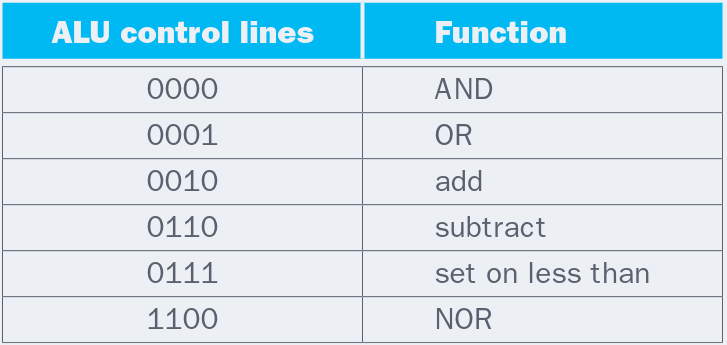

For the supported instructions, the effective ALU-control decoding can be summarized as follows:

#+caption: ALU-control decoding used by the processor
|---------+------------+-------------+-------------+------------------|
| ALUOp   | Funct      | ALU control | Operation   | Used by          |
|---------+------------+-------------+-------------+------------------|
| 00      | XXXXXX     |        0010 | add         | lw, sw, addi     |
| 01      | XXXXXX     |        0110 | subtract    | beq              |
| 10      | 100000     |        0010 | add         | add              |
| 10      | 100010     |        0110 | subtract    | sub              |
| 10      | 100100     |        0000 | AND         | and              |
| 10      | 100101     |        0001 | OR          | or               |
| 10      | 101010     |        0111 | set on less | slt              |
| 10      | 100111     |        1100 | NOR         | auxiliary code   |
|---------+------------+-------------+-------------+------------------|

In practice, this means that load, store, and immediate-add instructions all reuse the same ALU addition path, while /beq/ reuses subtraction and simply inspects the zero flag. Only the R-type instructions require the extra decoding step based on the function field.

** Sign extension, multiplexers, and address-generation blocks

Several support blocks are intentionally kept as small combinational elements so that each datapath transformation remains explicit. The sign-extension block replicates bit /15/ of the immediate field into the upper half of the /32-bit/ result. This preserves the sign of negative immediates and is therefore required by /addi/, /lw/, /sw/, and /beq/.

The three main multiplexers can be described directly by their selection truth tables:

#+caption: Multiplexer behavior in the datapath
|-----------+---------+----------------------+-------------------------------------------|
| Signal    | Sel=0   | Sel=1                | Role                                      |
|-----------+---------+----------------------+-------------------------------------------|
| RegDst    | rt      | rd                   | Select destination register               |
| ALUSrc    | reg[rt] | sign-extended imm    | Select second ALU operand                 |
| MemtoReg  | ALU out | data memory read     | Select the value written back to a register |
|-----------+---------+----------------------+-------------------------------------------|

These small selection blocks are essential because they allow the same datapath to serve both R-type and I-type instructions without duplicating arithmetic or register-write hardware. For example, /addi/ and /lw/ select the immediate as the second ALU operand, while R-type instructions select the second register operand.

Address generation for sequential execution and branches is also entirely combinational and follows the standard MIPS equations:

#+caption: Address-generation rules
|----------------+----------------------------------------------+------------------------------------|
| Quantity       | Expression                                   | Purpose                            |
|----------------+----------------------------------------------+------------------------------------|
| Sequential PC  | PC + 4                                       | Next instruction in normal flow    |
| Extended imm   | \texttt{sign\_extend(instr[15:0])}           | Immediate operand or branch offset |
| Shifted offset | \texttt{sign\_extend(instr[15:0])} << 2      | Word-aligned branch displacement   |
| Branch target  | (PC + 4) + (\texttt{sign\_extend(imm)} << 2) | Target address for /beq/             |
|----------------+----------------------------------------------+------------------------------------|

The left shift by /2/ reflects the fact that instructions are word-aligned. Once the branch offset has been shifted, it can be added to /PC + 4/ to form the final branch target. This makes the branch path easy to follow in the datapath: extend, shift, add, then choose between the sequential and branch addresses according to the branch decision.

** BRAM-based instruction and data memories

The instruction and data memories are not handwritten in VHDL; they are generated by Platform Designer and integrated at the top level in \texttt{/fpga/rtl/mips\_32.vhd/}. Both memories are true dual-port on-chip RAMs mapped onto the Cyclone V M10K resources. Figure [[fig:bram_block]] shows the generated on-chip memory structure.

#+attr_org: :width 650
#+caption: Generated BRAM block used for on-chip memory
#+name: fig:bram_block
#+attr_latex: :width 9cm
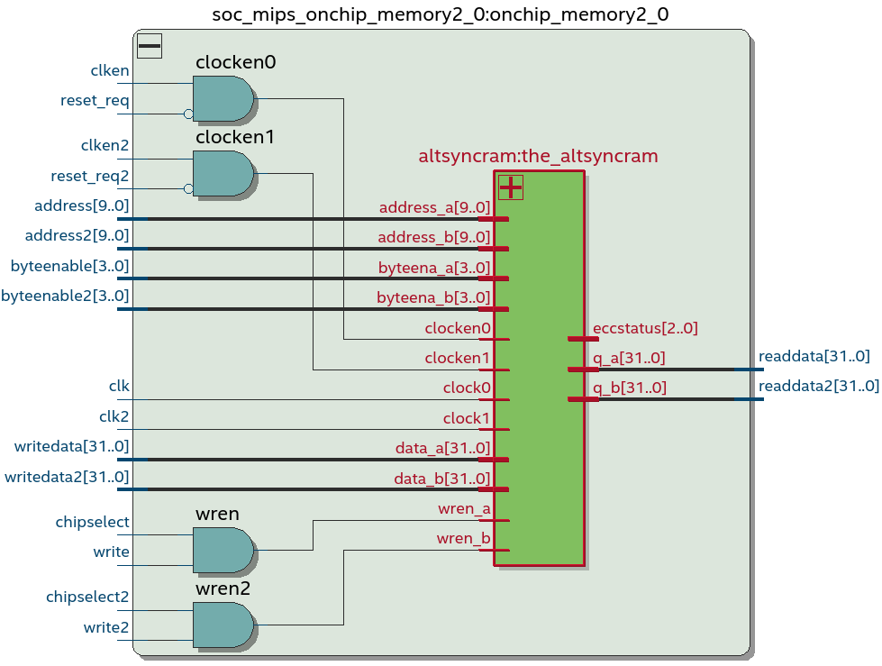

The complete system-level integration is easier to understand with the Platform Designer view shown in figure [[fig:platform_designer_map]]. This figure makes the role of the HPS-to-FPGA bridge explicit: the HPS lightweight AXI master is connected inside Platform Designer to a set of Avalon-MM slave peripherals implemented in the FPGA fabric.

#+attr_org: :width 750
#+caption: Platform Designer memory map and HPS-to-FPGA connections
#+name: fig:platform_designer_map
#+attr_latex: :width 15cm
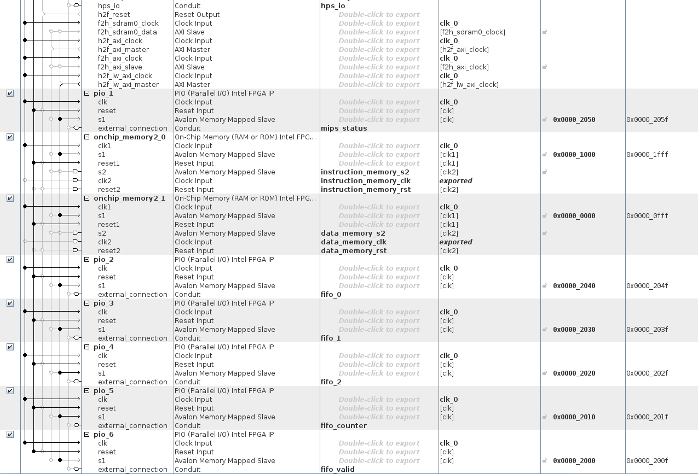

The key architectural point is that the two on-chip memories expose two different access paths. One path is the processor-side path exported to the handwritten VHDL as \texttt{instruction\_memory\_s2} and \texttt{data\_memory\_s2}. Those exported interfaces are driven directly by the processor datapath in \texttt{mips\_32.vhd}: the PC feeds the instruction-memory address, while the ALU result and store-data path feed the data-memory address and write channel. The second path is the HPS-side Avalon-MM slave interface visible in Platform Designer, which is reachable from Linux through the lightweight HPS-to-FPGA bridge. This dual-port organization allows the HPS to preload instructions and inspect results without stealing the processor's own memory port.

The instruction memory is addressed with \texttt{current\_pc(11 downto 2)}, which means that the program counter is byte-addressed while the BRAM is word-addressed. The two least significant bits are discarded because each instruction occupies one /32-bit/ word. The instruction memory is permanently enabled for reading and never written by the processor datapath itself.

The data memory is also addressed on a word basis through \texttt{dmem\_address}(11 downto 2). Its write data input is connected to \texttt{r2\_data\_o}, and its /4-bit/ byte-enable input is driven by \texttt{dmem\_byteen}. This interface allows the same generated BRAM to be used both by the processor datapath and by the HPS through the lightweight bridge. Because these BRAMs are synchronous, memory accesses cannot be completed in the same way as in a purely ideal single-cycle textbook model. This is one of the main reasons why the final processor was reorganized into fetch, execute, and write-back stages.

The Platform Designer figure is consistent with the software-visible address map already summarized in table [[tab:memory_map]]: separate windows are reserved for instruction memory, data memory, and lightweight status registers. Linux software on the HPS can therefore program the instruction BRAM and observe processor state through a single memory-mapped bridge, while the processor itself keeps its own datapath-side access to the same memories.

** Execution controller and observability blocks

The /switcher/ block in /fpga/rtl/core/switcher.vhd/ is the element that adapts the classical datapath to the practical staged execution used on the board. Internally, it synchronizes and edge-detects the push-button input, then uses a /2-bit/ state register to cycle through fetch, execute, and write-back. In automatic mode, the internal step pulse is forced active every cycle; in manual mode, a state advance only occurs on a detected button press.

The role of this execution-control and observability path is illustrated by figure [[fig:visual_observability]], which shows the demonstrator running on the DE10-Standard board.

#+attr_org: :width 750
#+caption: Board-level view of the execution controller and observability path
#+name: fig:visual_observability
#+attr_latex: :width 13cm
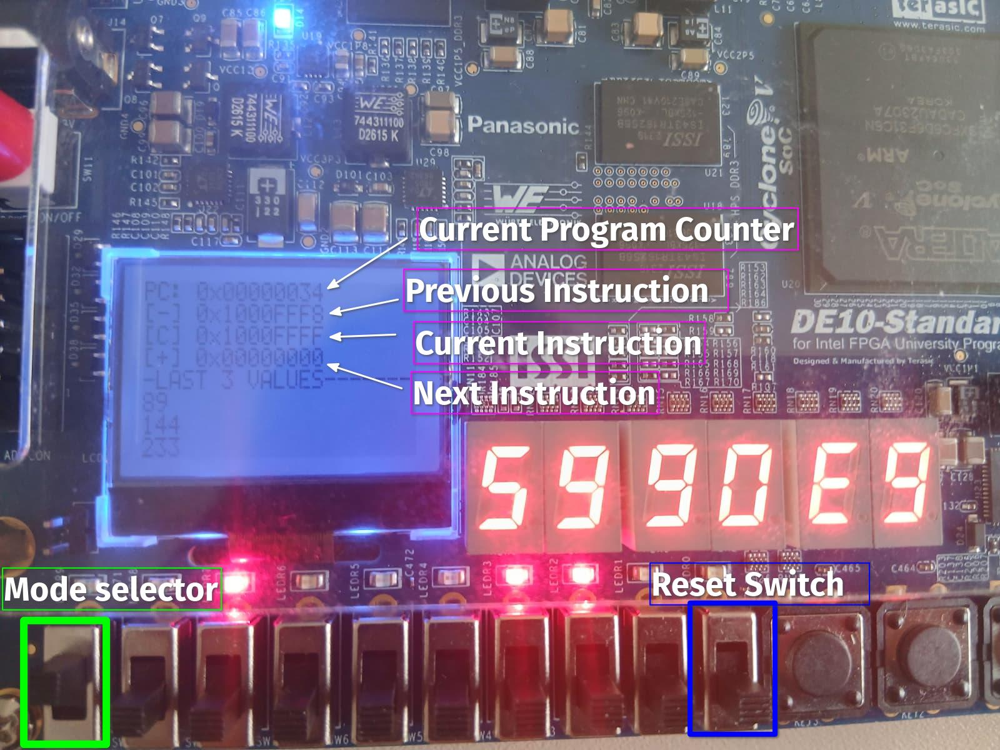

This controller gates the architectural side effects rather than recomputing the datapath itself. The program counter enable and register-file write enable are asserted only during the write-back state, while data-memory writes are only authorized during the execute state. The same block also drives the stage-indicator LEDs and forwards the /4-bit/ data-memory byte-enable bus only during the store phase. This is the key mechanism that converts the structurally single-datapath design into a verified /3-cycle/ execution sequence.

The figure illustrates the operator interface and control mechanisms. The mode-selector switch chooses between continuous execution and manual stepping, while the reset switch reinitializes the state of the processor. In manual mode, each valid button press advances the /switcher/ by one internal state transition, which makes it possible to observe fetch, execute, and write-back separately. The stage LEDs then provide an immediate indication of which phase is currently active.

The /fifo/ block in /fpga/rtl/core/fifo.vhdl/ is not part of the architectural datapath; it is a lightweight observability aid connected to store operations. Every time \texttt{dmem\_write} is asserted, it shifts the written value \texttt{r2\_data\_o} through three /32-bit/ registers, so the system keeps the three most recent stored words as \texttt{data\_0}, \texttt{data\_1}, and \texttt{data\_2}. These values are also exported to the HPS-visible status interface together with validity flags and an update counter.

The six seven-segment outputs only display the least significant byte of each stored word, split into hexadecimal nibbles. More precisely, /HEX0/ and /HEX1/ show bits /7 downto 0/ of the most recent value, /HEX2/ and /HEX3/ show bits /7 downto 0/ of the previous value, and /HEX4/ and /HEX5/ show bits /7 downto 0/ of the third value. In other words, this debug block only displays the last two hexadecimal digits of each number, not the full /32-bit/ word.

The same figure also clarifies the division of labor between the LCD and the seven-segment displays. The LCD is used for richer textual observation of the processor state, showing the current program counter together with the previous, current, and next instructions. This is useful for following control flow and checking that the fetch sequence matches the expected instruction stream. By contrast, the seven-segment displays are dedicated to the FIFO-based store monitor and give a compact real-time indication of the most recent values written by the program. Together, these two interfaces provide complementary observability: the LCD explains /where/ the processor is in the instruction stream, while the seven-segment displays summarize /what data/ has just been committed to memory.

** Integration technique at the top level

At the top level, the processor is assembled structurally in \texttt{fpga/rtl/mips\_32.vhd}. The register file addresses are taken directly from the instruction word, the sign extender expands the /16-bit/ immediate to /32 bits/, the ALU input multiplexer selects either the second register operand or the sign-extended immediate, and the branch address is computed by shifting the immediate left by /2/ and adding it to /PC + 4/. The branch decision itself is reduced to \texttt{pc\_src} <= \texttt{alu\_zero} and branch.

This structural style makes the implementation easy to compare with the standard MIPS datapath diagram while remaining explicit about the FPGA integration choices. In particular, the generated BRAM memories, the byte-enable handling for stores, and the execution gating performed by the /switcher/ block are all visible in the top-level structural netlist. As a result, the final implementation preserves the conceptual clarity of the Hennessy and Patterson datapath but adapts it to the realities of synchronous FPGA memories and HPS-assisted observation.

* Validation and results
** Functional validation

The project validation began at the block level. The ALU and ALU control were simulated first to verify the arithmetic and logical operations and the decoding of the function field for R-type instructions. The register file testbench then verified dual-read and single-write behavior, while the program counter testbench checked reset and sequential update behavior. Finally, the main control testbench verified the opcode-to-control-signal mapping for the supported R-type and I-type instructions.

After unit simulation, the HPS-FPGA communication path was validated independently through simple software utilities. The early tests confirmed successful reads and writes through the AXI bridge, which established a reliable method for loading instructions into instruction memory and reading back data memory contents. This step was critical because the later validation flow depends on software-side access to the processor state.

At the full-system level, the demonstrator was validated with assembly programs, in particular the Fibonacci example contained in /scripts/fibo.asm/. The end-to-end flow consists of assembling the source program into a hexadecimal image, programming the instruction memory from Linux, executing the processor on the FPGA, and reading or displaying the resulting internal state. The LCD monitor and the seven-segment displays were then used to confirm that the program counter advanced correctly and that data-memory writes produced the expected sequence of values.

** Hardware demonstration results

The main hardware demonstration consists of running the Fibonacci program and observing the resulting writes to data memory. The validation sequence used for the demonstrator is the following:

1. Synthesize and program the FPGA design with /make fpga-build/ then /make fpga-flash/.
2. Assemble the Fibonacci source file with:

   #+begin_src bash
   python3 scripts/assembler.py scripts/fibo.asm -o scripts/program.hex
   #+end_src

3. Deploy the flasher utility and the generated hexadecimal image to the HPS:

   #+begin_src bash
   make flasher_deploy
   #+end_src

4. Program the instruction memory from Linux:

   #+begin_src bash
   make flasher_run
   #+end_src

5. Observe execution either through direct memory readback with /make fibo-read/ or through the LCD monitor with \texttt{make lcd\_run}. The board-level observability setup used in this step, including the mode selector, reset switch, LCD monitor, and FIFO-driven seven-segment displays, is shown in figure [[fig:visual_observability]].

This validation flow is largely automated by the top-level /Makefile/. In particular, the target \texttt{flasher\_all} chains together the most repetitive tasks: generation of /program.hex/, deployment of the flasher utility, and execution of the flasher on the HPS. The \texttt{flasher\_all} utility illustrates the automated mechanism used for the Fibonacci demonstration. The important point is that the heavy work is scripted: files are copied to the board with /scp/, the flasher is compiled remotely through /ssh/, and the instruction memory is then programmed from the HPS side.

This flow confirms end-to-end coherence between the processor core, the BRAM-backed memory system, the HPS bridge, and the software utilities used for loading and observation.

The Fibonacci source program itself is compact but representative. It first initializes the registers used to hold the current term, the next term, the data-memory pointer, and the loop counter. It then iterates until the counter reaches /49/, storing one Fibonacci value per iteration into data memory, incrementing the write address by /4 bytes/ each time, and looping back with an unconditional branch encoded as /beq $0, $0, -8/. The final instruction is an infinite trap implemented as /beq $0, $0, -1/.

Before listing the full program image, it is useful to examine the encoding of the first instruction. The instruction /add $1, $0, $0/ is an R-type instruction, so its opcode is /000000/. The fields are then /rs = 00000/, /rt = 00000/, /rd = 00001/, /shamt = 00000/, and /funct = 100000/ for the /add/ operation. Concatenating these fields gives:

#+begin_src text
000000 00000 00000 00001 00000 100000
#+end_src

which corresponds to the hexadecimal word /00000820/. This matches the first line of /scripts/program.hex/ and provides a direct check that the assembler generates the expected machine code.

The corresponding machine-code image generated in /scripts/program.hex/ is listed in table [[tab:fibo_hex]]. This table was used during validation to check that the assembler and the flasher utility produced the expected instruction words in memory.

#+caption: Fibonacci program used during the hardware demonstration
#+label: tab:fibo_hex
|---------+--------------+----------------------|
| Address | Machine code | Assembly instruction |
|---------+--------------+----------------------|
|    0x00 |     00000820 | add $1, $0, $0       |
|    0x04 |     20020001 | addi $2, $0, 1       |
|    0x08 |     00001820 | add $3, $0, $0       |
|    0x0C |     20060000 | addi $6, $0, 0       |
|    0x10 |     20040031 | addi $4, $0, 49      |
|    0x14 |     10C40007 | beq $6, $4, 7        |
|    0x18 |     AC610000 | sw $1, 0($3)         |
|    0x1C |     00222820 | add $5, $1, $2       |
|    0x20 |     00020820 | add $1, $0, $2       |
|    0x24 |     00051020 | add $2, $0, $5       |
|    0x28 |     20630004 | addi $3, $3, 4       |
|    0x2C |     20C60001 | addi $6, $6, 1       |
|    0x30 |     1000FFF8 | beq $0, $0, -8       |
|    0x34 |     1000FFFF | beq $0, $0, -1       |
|---------+--------------+----------------------|

During execution, the first store writes the value /0/ at the first data-memory word, the second writes /1/, then the following iterations produce /1, 2, 3, 5, 8,/ and so on. Because the data-memory address pointer is incremented by /4/ after every iteration, each Fibonacci term is stored in a consecutive /32-bit/ word. This makes the program convenient for validation: the results can be checked both numerically through /fibo-read/ and visually through the FIFO-based display path.

Figure [[fig:normal_fibo]] shows a normal Fibonacci execution on the board. In this case, the sequence is still within the representable range of a /32-bit/ unsigned value, and the LCD monitor displays the current program counter, the surrounding instruction words, and the last values written to data memory. This image illustrates the normal operating mode of the demonstrator when the processor is allowed to run continuously.

#+attr_org: :width 500
#+caption: Normal Fibonacci execution observed on the board
#+name: fig:normal_fibo
#+attr_latex: :width 10.5cm :options angle=0
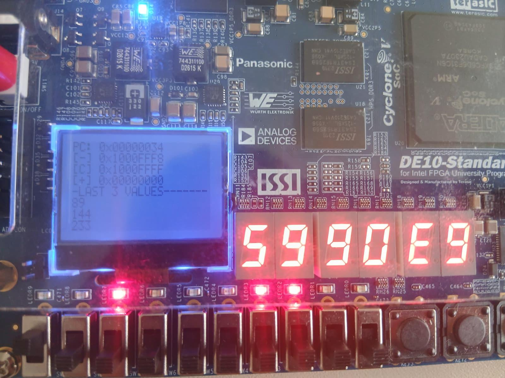

Figure [[fig:limit_32bit]] illustrates the /32-bit/ limit of the processor state. As the Fibonacci sequence grows, the computed values eventually exceed /2^{32}/. Since the datapath and the register file are only /32 bits/ wide, the result wraps around modulo /2^{32}/. The board image makes this limitation visible directly: once the mathematical Fibonacci value exceeds the representable range, the stored result no longer corresponds to the true integer sequence but to its truncated /32-bit/ value.

#+attr_org: :width 500
#+caption: Fibonacci overflow caused by the 32-bit datapath limit
#+name: fig:limit_32bit
#+attr_latex: :width 10.5cm :options angle=90
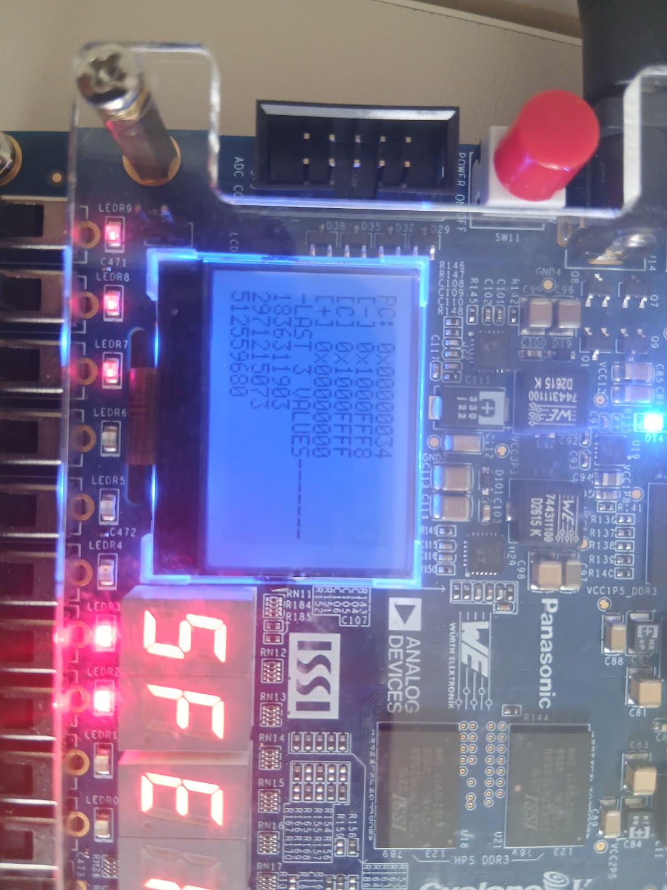

The same display infrastructure was also used to validate the more general instruction-subset demonstration program in /scripts/isa.asm/. This second program exercises arithmetic instructions, comparisons, memory stores, a load, and a final update of a loaded value. Figure [[fig:isa_demo]] shows the board during this validation sequence. In contrast with the Fibonacci demo, this image is useful to confirm that the processor is not restricted to one benchmark only, but can also execute a short mixed ISA validation program covering the supported instruction classes.

#+attr_org: :width 500
#+caption: Execution of the ISA validation program on the board
#+name: fig:isa_demo
#+attr_latex: :width 10.5cm :options angle=90
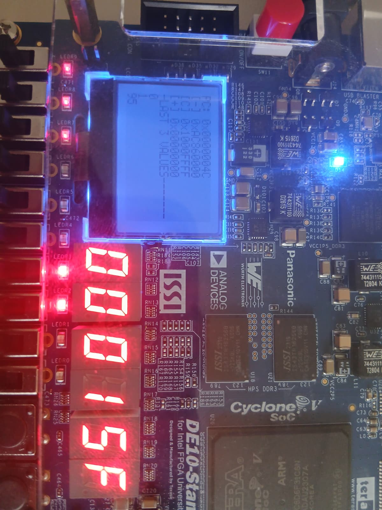

** Detailed operation of the processor during the demo

The internal operation of one instruction during the demonstration follows the three-stage organization defined previously.

1. In the /fetch/ state, the current value of the program counter selects one word in instruction memory.
2. In the /execute/ state, the instruction is decoded, the registers are read, and the ALU computes either an arithmetic result, a comparison result, or an effective address.
3. In the /write-back/ state, the architectural state is updated: a register write occurs for arithmetic or load instructions, while a store updates data memory.

The /switcher/ block implements this sequencing with three states, exposed on the LEDs as fetch, execute, and write-back indicators. The program counter is only advanced at the end of the write-back state, so one complete instruction always requires /three clock cycles/ in the current implementation.

** Single-step operation and automatic mode

One of the useful validation features of the design is the possibility to observe the processor either instruction step by instruction step or in continuous automatic execution.

In /manual single-step mode/, /SW(9)/ is set to logic /1/. In this configuration, the /switcher/ block converts the debounced push-button event on /KEY(0)/ into a single /step pulse/. Each press on /KEY(0)/ advances the internal execution state by exactly one stage: fetch, then execute, then write-back, then back to fetch for the next instruction. This mode is useful to observe the exact evolution of the program counter, the write-enable signals, and the stored values.

To pass to /automatic mode/, /SW(9)/ must be returned to logic /0/. In that case, the /switcher/ drives /step_pulse/ permanently to /1/, so the state machine advances automatically on every rising edge of the /50 MHz/ clock. The processor then runs continuously without requiring any push-button interaction. In practice, this is the mode used when the goal is to let the Fibonacci program run to completion and inspect the resulting data-memory contents afterward.

** Resource utilization

The Quartus fitter reports a successful compilation for the /Cyclone V 5CSXFC6D6F31C6/ device. The final implementation uses /2,000 ALMs/ out of /41,910/ available, corresponding to /5 %/ of the device logic resources. It also uses /3,230 registers/, /65,536/ block memory bits, and /8/ RAM blocks. No DSP block is required by the current implementation. The complete resource summary is presented in table [[tab:resources]].

#+caption: Post-fit resource utilization
#+label: tab:resources
|-------------------+--------------------------|
| Resource          | Utilization              |
|-------------------+--------------------------|
| Logic (ALMs)      | 2,000 / 41,910 (5 %)     |
| Registers         | 3,230                    |
| Pins              | 173 / 499 (35 %)         |
| Block memory bits | 65,536 / 5,662,720 (1 %) |
| RAM blocks        | 8 / 553 (1 %)            |
| DSP blocks        | 0 / 112 (0 %)            |
| PLLs              | 0 / 15 (0 %)             |
| DLLs              | 1 / 4 (25 %)             |
|-------------------+--------------------------|

These numbers show that the processor itself occupies only a modest fraction of the FPGA resources. Most of the memory usage is due to the two /1024 \times 32/ on-chip memories and the associated Platform Designer infrastructure.

* Theoretical discussion

The theoretical questions proposed at the beginning of the project were formulated during the project follow-up meeting for the originally intended pipelined version. Since the final demonstrator is a non-pipelined implementation with staged execution rather than an overlapped five-stage pipeline, these questions must be answered at two levels: first as architectural questions about a classical MIPS pipeline, and then in relation to the processor that was actually implemented and demonstrated.

** Why is a Harvard architecture required for a 1-CPI objective?

In a classical five-stage MIPS pipeline, the /IF/ stage fetches the next instruction while the /MEM/ stage may simultaneously access data memory for a /lw/ or /sw/. If a single shared memory is used for both purposes, these two accesses compete for the same hardware resource during the same clock cycle. This creates a /structural hazard/. The processor must then either stall one of the stages or accept a CPI greater than /1/.

This is why a Harvard organization is the natural solution when the design target is /1 CPI/: separate instruction and data memories remove that resource conflict and allow instruction fetch and data access to proceed in parallel. In the implemented processor, two distinct on-chip memories are already used, one for instructions and one for data. Even though the current core is not a fully pipelined processor, this memory organization remains theoretically correct and would still be the right choice for a future pipelined version.

** How should a RAW hazard after /lw/ be handled?

A /read-after-write/ hazard appears when one instruction produces a value that the very next instruction needs before that value has become available in the pipeline. The classical example is:

#+begin_src asm
lw   $t0, 0($t1)
add  $t2, $t0, $t3
#+end_src

In a pipelined implementation, the loaded data is only available after the memory access stage. The following /add/ instruction needs the operand earlier, during its execute stage. Without corrective action, it would use an incorrect value. The two standard solutions are:

1. /Stalling/: insert one bubble so that the consumer instruction waits until the loaded value is ready.
2. /Forwarding/: bypass the produced value from a later pipeline stage to the operand input of the dependent instruction.

For the specific /lw-use/ case, forwarding alone is usually not enough in a basic five-stage MIPS pipeline, because the data arrives too late in the cycle. At least one stall cycle is generally required unless the memory timing and pipeline organization are modified.

In the implemented processor, this hazard does not appear in the same form because instructions are not overlapped in a true pipeline. Execution is serialized over the fetch, execute, and write-back stages, so one instruction completes its architectural update before the next instruction reaches the corresponding dependent point. The theoretical hazard remains important, but it belongs to the pipelined version that was planned rather than to the current demonstrator.

** How should the branch delay slot be managed?

The /branch delay slot/ is a historical feature of early MIPS processors. In that model, the instruction immediately following a branch is always executed, even if the branch is taken. This convention simplifies some pipeline timing issues because the next sequential instruction has already been fetched before the branch decision is fully known.

From a theoretical perspective, managing the branch delay slot means defining a clear contract between hardware and software. The processor, assembler, and generated programs must all agree that the instruction after the branch will execute. The compiler or programmer can then place either a useful independent instruction in that slot or a /nop/ when no safe instruction exists.

In the implemented processor, this architectural contract is not exposed. Branches are handled by computing the comparison result and selecting the next value of the program counter through the branch-selection logic, but the demonstrator does not implement a visible delay-slot mechanism like the historical MIPS R2000. For that reason, the correct answer in the context of this project is that the delay slot is an important theoretical issue for the originally proposed pipeline, but it is not a verified feature of the delivered processor.

** How can the control unit generate datapath signals within one cycle in VHDL?

This question is fundamental because it often seems counterintuitive when coming from a software background. In VHDL, the control unit is not a sequence of instructions executed one after another. It is a /combinational circuit/ described textually. The opcode, and for R-type instructions the function field, propagate through logic equations that continuously produce the control signals required by the datapath.

During a clock period, the instruction bits propagate through the decoder, multiplexers, ALU-control logic, and other combinational blocks. As long as the propagation delay remains smaller than the clock period, the signals settle to stable values before the active clock edge. At that clock edge, the sequential elements such as the program counter, register file, and memory interfaces capture the resulting values.

The expression “within one cycle” therefore does not mean that the control unit performs a software-like sequence of steps instantaneously. It means that the combinational logic has enough time to settle during the clock period so that all required control signals are valid when the sequential state elements sample them. This explanation remains valid both for the originally intended pipeline and for the non-pipelined processor that was actually implemented.

Overall, the theoretical questions remain relevant because they explain the main architectural difficulties of moving from a simple MIPS-style datapath to a true pipelined processor. The present project answers them in two ways: practically, by showing a working non-pipelined implementation on FPGA, and conceptually, by identifying the additional mechanisms that would be required to reach the original pipelined objective.

* Acknowledgments

This project was completed independently as a solo effort. I acknowledge the use of the Intel Quartus Prime and Platform Designer tools, the Intel SoC EDS libraries for HPS interfacing, and the foundational MIPS processor architecture described in the textbook by Hennessy and Patterson. The project benefited from the guidance provided during the follow-up meetings and from the technical resources made available through the MODAL course.

* Conclusions

This project demonstrates the implementation of a MIPS32-style soft processor on the DE10-Standard Cyclone V SoC platform, integrated with the ARM HPS for program loading, monitoring, and debugging. The resulting system supports a useful subset of the MIPS ISA, uses separate instruction and data memories, and can be driven from Linux user space through the lightweight AXI bridge.

From an engineering perspective, the main result is not only the processor itself but the complete demonstrator around it: automated build scripts, software-side programming tools, memory-mapped diagnostics, and an LCD-based runtime monitor. The unit simulations, HPS bridge validation, and board-level Fibonacci demonstration show that the implemented architecture is functionally consistent and practically usable.

The current version remains an intermediate but solid milestone. It is functionally operational and suitable for demonstration and analysis, but it is not yet a fully pipelined, fully timing-closed implementation of the classical MIPS R2000 architecture. This leaves a clear direction for future work: deeper pipelining, hazard management, ISA extension, and timing optimization.
bibliographystyle:IEEEtranN
bibliography:~/Documents/org/Mylibrary.bib
